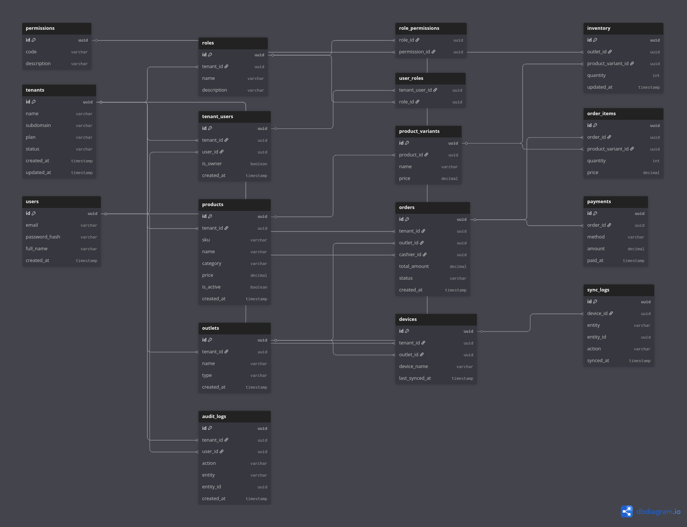

# Database Design - Adaptive SaaS POS

This document outlines the multi-tenant database architecture for our POS system.
The system uses **Logical Isolation** (Shared Database) for global entities and
is designed to support **Physical Isolation** (Schemas) for tenant data.

## Entity Relationship Diagram (ERD)



## Core Architecture Principles

### 1. Multi-Tenancy Strategy

We use the `tenant_id` column across all operational tables to ensure data isolation.
For production, the `tenants` table resides in the `public` schema, while
operational tables (Products, Orders, etc.) are cloned into individual tenant schemas.

### 2. Flexible Product Metadata

While the `products` table contains core fields (SKU, Price), we utilize the
`product_variants` table to handle industry-specific attributes:

- **Apotek:** Dosage, Batch Number, Expiry.
- **Fashion:** Size, Color, Material.

### 3. Synchronization & Offline Support

The `devices` and `sync_logs` tables allow local POS hardware to sync transactions
asynchronously, ensuring the business stays operational during internet outages.

## DBML Source Code

To edit this diagram, copy the code below and paste it into [dbdiagram.io](https://dbdiagram.io).

<details>
<summary>Click to expand DBML Syntax</summary>

```dbml
Table tenants {
  id uuid [pk]
  name varchar
  subdomain varchar [unique] // subdomain
  plan varchar
  status varchar
  created_at timestamp
  updated_at timestamp
}

Table users {
  id uuid [pk]
  email varchar [unique]
  password_hash varchar
  full_name varchar
  created_at timestamp
}

Table tenant_users {
  id uuid [pk]
  tenant_id uuid [ref: > tenants.id]
  user_id uuid [ref: > users.id]
  is_owner boolean
  created_at timestamp
}

Table roles {
  id uuid [pk]
  tenant_id uuid [ref: > tenants.id]
  name varchar
  description varchar
}

Table permissions {
  id uuid [pk]
  code varchar [unique] // e.g. product.read, order.refund
  description varchar
}

Table role_permissions {
  role_id uuid [ref: > roles.id]
  permission_id uuid [ref: > permissions.id]

  indexes {
    (role_id, permission_id) [unique]
  }
}

Table user_roles {
  tenant_user_id uuid [ref: > tenant_users.id]
  role_id uuid [ref: > roles.id]

  indexes {
    (tenant_user_id, role_id) [unique]
  }
}

Table outlets {
  id uuid [pk]
  tenant_id uuid [ref: > tenants.id]
  name varchar
  type varchar // store, warehouse, hotel, etc
  created_at timestamp
}

Table products {
  id uuid [pk]
  tenant_id uuid [ref: > tenants.id]
  sku varchar
  name varchar
  category varchar
  price decimal
  is_active boolean
  created_at timestamp
}

Table product_variants {
  id uuid [pk]
  product_id uuid [ref: > products.id]
  name varchar // size, color, dosage
  price decimal
}

Table inventory {
  id uuid [pk]
  outlet_id uuid [ref: > outlets.id]
  product_variant_id uuid [ref: > product_variants.id]
  quantity int
  updated_at timestamp
}

Table orders {
  id uuid [pk]
  tenant_id uuid [ref: > tenants.id]
  outlet_id uuid [ref: > outlets.id]
  cashier_id uuid [ref: > users.id]
  total_amount decimal
  status varchar // completed, refunded, void
  created_at timestamp
}

Table order_items {
  id uuid [pk]
  order_id uuid [ref: > orders.id]
  product_variant_id uuid [ref: > product_variants.id]
  quantity int
  price decimal
}

Table payments {
  id uuid [pk]
  order_id uuid [ref: > orders.id]
  method varchar // cash, qris, card
  amount decimal
  paid_at timestamp
}

Table devices {
  id uuid [pk]
  tenant_id uuid [ref: > tenants.id]
  outlet_id uuid [ref: > outlets.id]
  device_name varchar
  last_synced_at timestamp
}

Table sync_logs {
  id uuid [pk]
  device_id uuid [ref: > devices.id]
  entity varchar // order, inventory
  entity_id uuid
  action varchar // create, update
  synced_at timestamp
}

Table audit_logs {
  id uuid [pk]
  tenant_id uuid [ref: > tenants.id]
  user_id uuid [ref: > users.id]
  action varchar
  entity varchar
  entity_id uuid
  created_at timestamp
}
```

</details>
